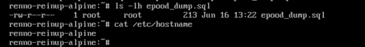
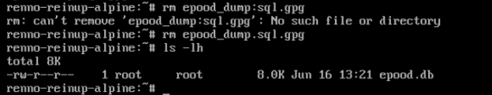
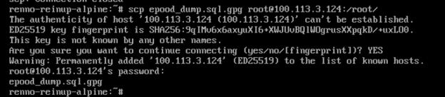
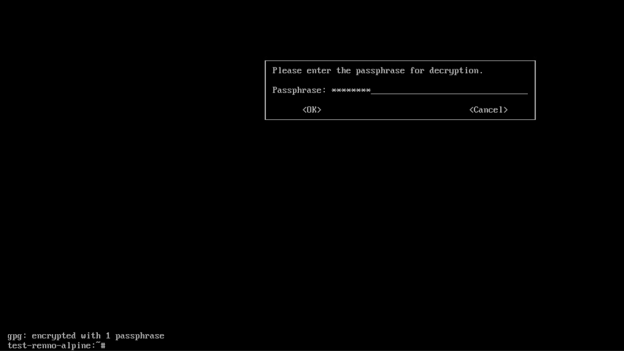
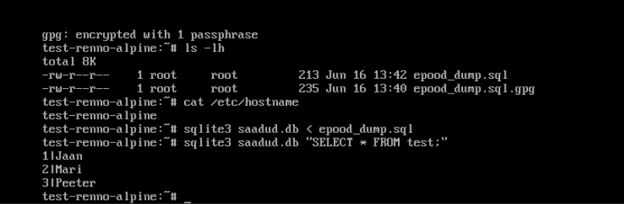
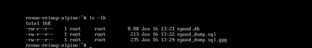
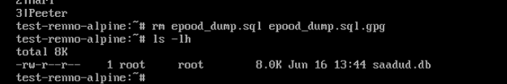

# Dump-faili turvaline edastamine kahe Alpine Linux masina vahel

**Masinad:**
- Saatja: `renno-reinup-alpine` (Tailscale IP: `100.123.227.127`)
- Vastuvõtja: `test-renno-alpine` (Tailscale IP: `100.113.3.124`)

**Kanal:** Tailscale (WireGuard-põhine privaatne võrk) + SCP (SSH krüpteeritud ühendus)

**Krüpteering:** GPG sümmeetriline krüpteering (AES256) enne transporti

---

## Samm 1 — Dump-faili loomine saatja masinas

**Selgitus:** Saatja masinas (`renno-reinup-alpine`) loodi SQLite andmebaasist dump-fail käsuga `sqlite3 epood.db .dump > epood_dump.sql`. Fail on 213 baiti. `cat /etc/hostname` kinnitab masina identiteeti.

---

## Samm 2 — Dump-faili krüpteerimine GPG-ga

**Selgitus:** Saatja masinas (`renno-reinup-alpine`) krüpteeriti dump-fail käsuga `gpg -c --cipher-algo AES256 epood_dump.sql`. Tulemuseks tekkis `epood_dump.sql.gpg` (235 baiti). Krüpteerimata `epood_dump.sql` kustutati seejärel — failide nimekirjas on näha ainult `.gpg` fail. Fail ei olnud mitte ühel hetkel avalikus asukohas.

---

## Samm 3 — Turvaline transport SCP kaudu üle Tailscale

**Selgitus:** Krüpteeritud fail saadeti saatja masinast (`renno-reinup-alpine`) vastuvõtja masinasse (`test-renno-alpine`) käsuga `scp epood_dump.sql.gpg root@100.113.3.124:/root/`. Transport toimus üle Tailscale privaatse WireGuard-tunneli SSH kaudu — fail ei puutunud kordagi avaliku internetti. SSH host key fingerprint kinnitati käsitsi (`YES`).

---

## Samm 4 — GPG parooli sisestamine vastuvõtja masinas

**Selgitus:** Vastuvõtja masinas (`test-renno-alpine`) käivitati `gpg -d epood_dump.sql.gpg > epood_dump.sql`. GPG küsis dekrüpteerimise parooli, mis edastati eraldi kanali kaudu (mitte koos failiga). Parool sisestati ja dekrüpteerimine õnnestus (`gpg: encrypted with 1 passphrase`).

---

## Samm 5 — Import ja kontrollpäring vastuvõtja masinas

**Selgitus:** Vastuvõtja masinas (`test-renno-alpine`) imporditi dump SQLite andmebaasi käsuga `sqlite3 saadud.db < epood_dump.sql` ja kontrolliti andmeid päringuga `sqlite3 saadud.db "SELECT * FROM test;"`. Tulemus: `1|Jaan`, `2|Mari`, `3|Peeter` — andmebaas töötab. `cat /etc/hostname` kinnitab vastuvõtja masina identiteeti.

---

## Samm 6 — Ajutiste failide kustutamine vastuvõtja masinas

**Selgitus:** Vastuvõtja masinas (`test-renno-alpine`) kustutati ajutised failid käsuga `rm epood_dump.sql epood_dump.sql.gpg`. Järel on ainult `saadud.db` — dump-failid on eemaldatud.

---

## Samm 7 — Ajutiste failide kustutamine saatja masinas

**Selgitus:** Saatja masinas (`renno-reinup-alpine`) kustutati `epood_dump.sql.gpg`. Järel on ainult algne `epood.db` — kõik ajutised failid on eemaldatud mõlemast masinast.

---

## Turvalisuse kokkuvõte

| Nõue | Täidetud |
|------|----------|
| Dump krüpteeriti enne transporti | ✅ GPG AES256 |
| Transport turvalise kanali kaudu | ✅ SCP üle Tailscale WireGuard |
| Fail ei olnud avalikus asukohas | ✅ Ainult privaatses Tailscale võrgus |
| Impordiprotsess dokumenteeritud | ✅ SELECT päring töötab |
| Mõlema masina hostname nähtav | ✅ `renno-reinup-alpine` ja `test-renno-alpine` |
| Ajutised failid kustutatud | ✅ Mõlemast masinast |
